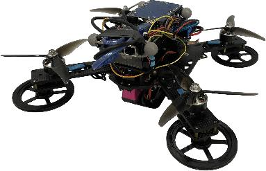
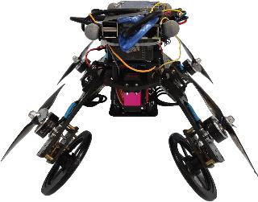
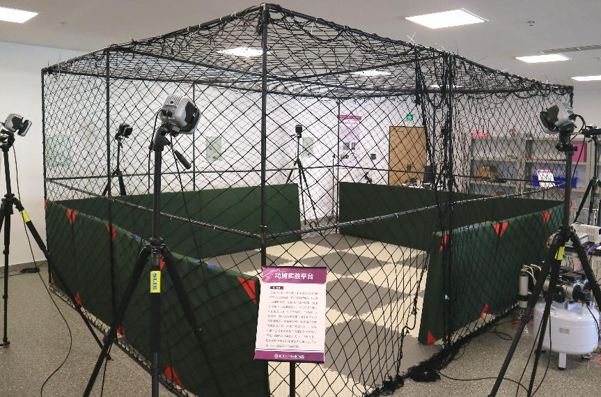
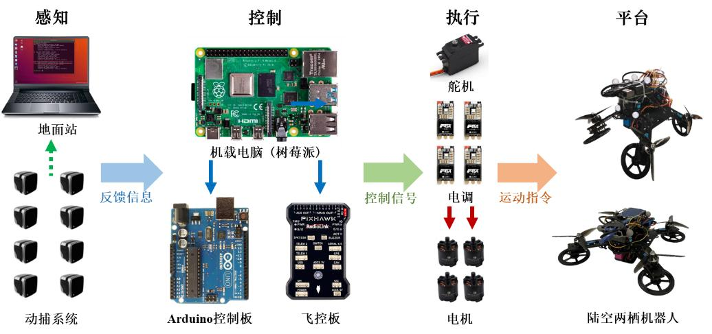
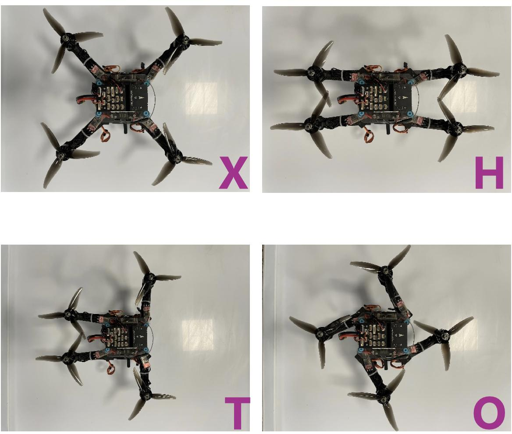
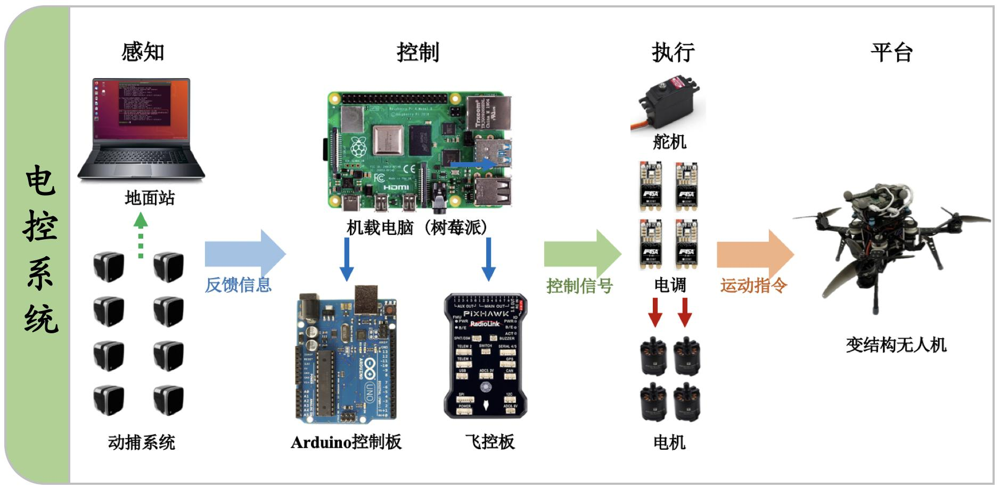
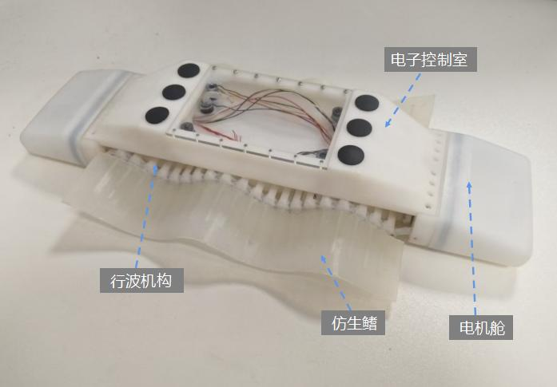

## 6.1 陆空两栖机器人

陆空两栖机器人，一种融合了地面无人车辆与空中四旋翼飞行器的新型变结构机器人，与传统的无人车和无人机相比，具有较强的适应性和高灵活性。它不仅拥有更广泛的应用前景，还具备更深入的研究意义，因此逐渐成为国内外的研究热点。

### 6.1.1 研究挑战

- 欠驱动特性：无论是在地面运动模态还是空中飞行模态下，陆空两栖机器人都面临着“以少控多”的挑战，这对控制方法的设计提出了更高的要求。
- 非线性、强耦合性：陆空两栖机器人的各个状态相互耦合且具有较强的非线性特征，引入折叠角后，系统的非线性和耦合性进一步增强。
- 模态切换特性：陆空两栖机器人在执行陆地/空中模态切换和空中展平/折叠模态切换任务时，往往会导致其动态系统发生变化，从而可能引发系统失衡，甚至失控。
- 跨域运动特性：陆空两栖机器人陆地/空中运动模式差异较大，然而同一任务往往要求机器人进行连续的跨域作业，这为其运动规划和控制方法带来了更大的挑战。

### 6.1.2 研究成果

搭建了陆空两栖机器人原型样机；

- 搭建了基于动捕平台的实验环境；
- 设计了变结构机器人统一系统框架；
- 提出了陆空两栖机器人陆空跨域路径规划方法；
- 提出了陆空两栖机器人变模态平滑切换方法；
- 提出了陆空两栖机器人路径跟踪方法；
- 17th ICIRA Best Paper Finalist Award
- 第一届全国建筑机器人技能大赛-创意竞赛金牌
- 第2届中国自动化学会博士学术交流会最佳海报奖
- 中国国际大学生创新大赛(2024)天津赛区高教主赛道铜奖
- 第二十六届中国国际高新技术成果交易会优秀科研成果创新奖
- 2024年天津机器人科技创新奖-技术突破奖

图1. 陆空两栖机器人原型样机

<!--  -->

图2. 基于动捕平台的实验环境

图3. 变结构机器人统一系统框架

### 6.1.3 实验视频









## 6.2 变结构无人机

无人机由于其操作简单，机动性强，成本低，稳定性高等优势，广泛应用于军事领域和民用领域，如侦察、打击、运输、资源勘探、搜索救援、工程巡检等场景。然而现有的传统固定结构无人机在面向复杂的作业环境时作业模态单一，环境适应性弱。因此，我们根据自然界中的鸟类飞行时可通过折叠翅膀的仿生学原理，研制了一种可变结构的无人机，从而提高无人机的环境适应性。

### 6.2.1 研究挑战

- 机架刚度降低，稳定性降低：由于可变结构的设计，使得机身和机臂的连接处为可转动的关节，使得无人机整体刚性降低，稳定性降低；
- 变模态切换困难：模态切换时保持无人机的飞行稳定性控制困难；
- 建模困难：在建模时需要考虑无人机结构变化引起的重心和转动惯量变化。

### 6.2.2 研究成果

- 研制了可稳定飞行的变结构无人机3代实验平台；
- 建立了考虑重心和转动惯量变化的完整动力学模型；
- 发表会议论文2篇，其中一篇获得17th ICIRA Best Paper Finalist Award，第一届全国建筑机器人技能大赛创意竞赛金牌，中国国际大学生创新大赛（2024）天津赛区高教主赛道铜奖，第二十六届中国高新技术成果交易会优秀科研成果创新奖等。

图1. 变结构无人机平台

图2. 四种常用模态

图3. 电控系统图

图4. 软件架构图

### 6.2.3 实验视频




## 6.3 自重构机器人

传统的移动机器人结构固定，难以适应时变的环境。自重构模块化移动机器人是指由一系列移动机器人模块组装而成、能够根据所处环境或任务的变化依靠模块间的相互通信和自主移动重组为另一种适应新环境、新任务构型的机器人，具有多功能性、鲁棒性和重用性等诸多优点。此外，波状爬行机构受到微生物通过鞭毛游动的启发，其能够在不同的表面移动，并采用单个驱动器驱动整个机构爬行，具备高集成度的特点。将波状爬行机构应用于自重构模块化移动机器人，能够取长补短，具有较高的应用价值。

### 6.3.1 研究挑战

- 自重构波状爬行机器人在并联模态下可以实现差速转向，执行任务时需考虑运动特性、目标设定和约束条件，因此运动规划是自重构功能的基础。
- 机器人通过物联网远程控制，其电池续航和资源有限，然而传统控制方法浪费资源，需通过触发机制减少通信频率，同时在控制律设计中平衡能耗与性能指标。

### 6.3.2 研究成果

- 研制了自重构波状爬行机器人控制系统及样机
- 发表SCI论文2篇（包括IEEE Robotics and Automation Letters），受理发明专利一项，获得2023年挑战杯天津市三等奖、2023年互联网+天津市铜奖等。

### 6.3.3 实验视频



## 6.4 水陆两栖

自主移动机器人是可以在特定环境下进行坐标移动的机器人，其具有感知、交互、定位、运动规划、导航、决策等功能，可以执行特定任务，实现预期目标。

根据陆地、空中、水域等应用领域划分，主要包括单栖移动机器人和多栖移动机器人。就执行机构而言，陆地移动机器人的移动方式主要有足式、轮式、履带等，空中移动机器人的移动方式主要有螺旋桨，水域移动机器人的移动方式主要有喷水推进器、螺旋桨等，基于上述设计的移动机器人的理论基础与基本原理都已发展得非常成熟，趋于饱和。

在军事应用领域中，新型仿生水陆两栖机器人可用于水域和陆地任务，对军事领域具有战略价值。它可以执行水下侦察、搜救、情报收集和水下设施维护等任务。在军事操作中，仿鳐鱼机器人可以执行潜艇监测、水下爆炸物排除、敌方港口侦察等关键任务，减少人员风险。在经济应用领域中，仿鳐鱼两栖机器人可用于海洋资源开发，如水下采矿、渔业资源管理和海洋地质勘探。它还可以用于环境监测和污染控制，有助于保护海洋生态系统，促进可持续发展。

### 6.4.1 研究挑战

由于现有水陆两栖机器人复杂执行机构带来了诸多问题，亟需设计一种新型结构的水陆两栖机器人突破移动机构设计壁垒。同时，由于所设计的新型仿生水陆两栖机器人具有行波特性，存在高非线性、不确定性、水陆切换适应性，以及输入约束等研究难点。开发该机器人水陆两栖运动规划，陆地爬行控制和水域仿生鳍波动控制，使其能够实时应对环境变化，安全、高效地完成任务，具有重要的研究价值。

### 6.4.2 研究成果

- 从工程角度出发，通过问题提炼，设计了新型仿生水陆两栖移动机器人，并搭建了实验样机平台
- 受理中国发明专利1件

### 6.4.3 实验视频





## 6.5 仿腕关节机器人

受人类手臂启发的机械手在制造业、物流和仓储、农业等领域发挥着关键作用，将工人从简单重复的任务中解放出来。同时，作为机械手的重要组成部分，关节直接决定了机械手的灵活性、机动性和刚度。然而，刚性连杆方式机械手只能通过离散关节实现弯曲运动，这严重限制了其在受限操作空间内的灵活性和机动性。飞机舱内装配、核电设备维护和太空舱外作业等领域对机械臂的灵活性提出了更高的要求。

### 6.5.1 研究挑战

- 绳驱动刚性关节是提高机械手灵活性的绝佳选择，但其前端关节的驱动绳会穿过后端关节，在驱动前端关节移动时，不可避免地会影响后端关节的状态，导致定位精度降低。
- 软体关节理论上具有无限的自由度，但软性材料引起的低刚度和复杂的驱动非线性问题仍有待解决，限制了其在受限空间中的应用。

### 6.5.2 研究成果

针对上述问题，课题组设计了一种新颖的仿腕关节，基于反平行四边形原理，利用单关节同时满足俯仰和偏转两个自由的运动需求。针对仿腕关节的运动学建模、轨迹规划等问题开展了深入研究，并将其应用在机械臂和机械抓手等操作平台。此外，通过自主搭建的仿腕关节实验平台，验证了系统的灵活性和适用性。相关成果发表在国际权威期刊Journal of Field Robotics，获得CFIMA最佳论文奖。

### 6.5.3 实验视频


