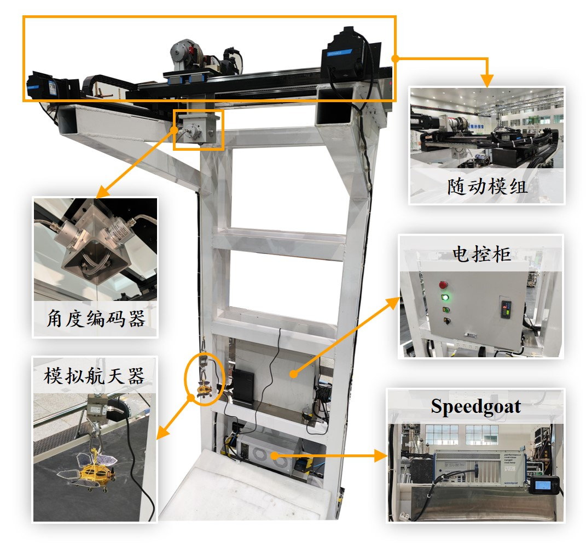

## 3.1 航天器悬吊/气浮时微低重力模拟系统

航天器需在微低重力环境下运行，但其制造与测试必须在地球重力条件下进行。不同重力环境对航天器的动力学特性影响显著，因此，微低重力模拟系统对于验证航天器性能、确保任务执行至关重要。悬吊法是一种常用模拟技术，通过吊装装置悬挂航天器，并控制吊绳张力等于其重力，以模拟微重力环境，广泛应用于运动控制测试。

### 3.1.1 研究挑战

- 高安全性的随动跟踪控制：二维平动机构需精准跟踪未知运动轨迹的卸载目标，具备快速响应能力，确保高效调整运动轨迹应对动态变化。
- 高精度恒张力控制：实时感知卸载力并动态调节吊绳运动，确保卸载过程中张力始终恒定。
- 大范围底座跟随控制：基于气浮技术的动平台可在大平面范围内广泛跟随目标，同时二维平动机构提供高响应速度和跟随精度。

### 3.1.2 研究成果

- 研制大型空间结构智能提升装置，可对特定荷载进行重力卸载，并实现大范围随动跟随。核心技术包括二维平动机构、恒张力控制、气浮动平台及地面控制系统。
- 系统可自主执行规划轨迹运动，并在花岗岩平台上平稳越缝，无卡滞现象。
- 悬吊动态卸载误差≤1%（包括水平与竖直方向），所提基于CBF的随动控制方法将偏角误差限制在0.4°以内。

### 3.1.3 实验视频




