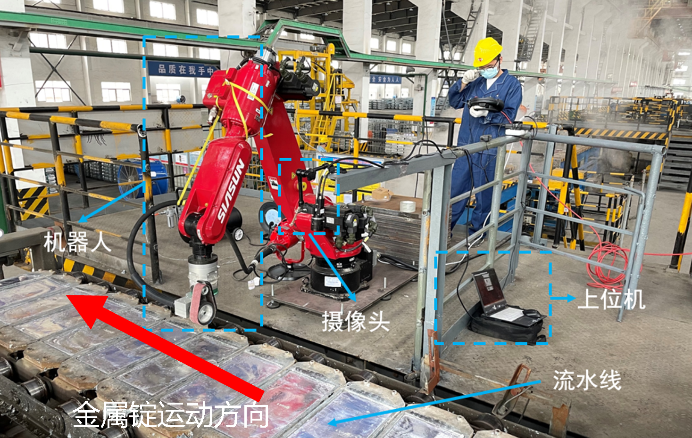
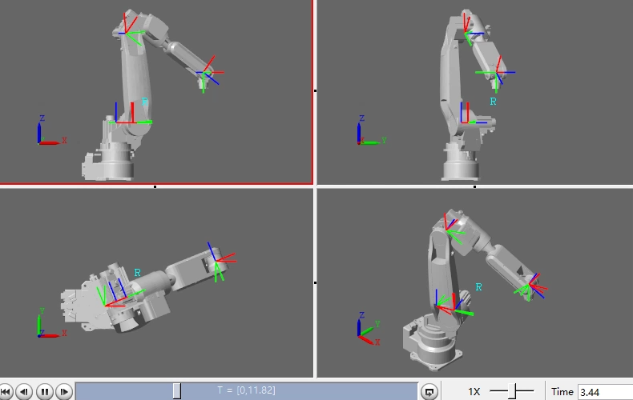
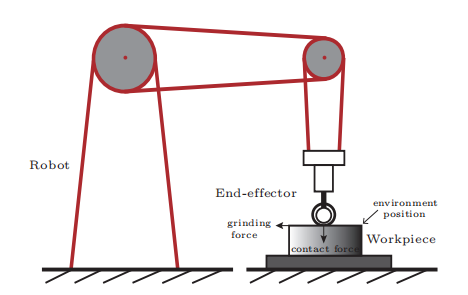

## 7.1 环境感知&目标识别

当机器人在特种环境下作业时，如何获取作业对象的关键信息是亟待解决的科研难点。特种作业环境一般意味着高温、蒸汽和复杂混乱的背景等恶劣条件，这些恶劣条件会严重影响机器人信息获取的准确率和实时性，使得机器人无法依据实际环境情况进行工作。智能感知作为机器人的“眼睛”，需要通过更加高效的算法在特种作业环境下实现识别、检测和定位等感知功能。

### 7.1.1 研究挑战

- **恶劣的环境条件：** 感知图像的背景极为复杂，存在着大量的干扰信息，需要准确将作业对象的信息提取出来。高温、蒸汽和持续变化的光照条件也会使图像信息发生变化，给准确感知作业对象关键信息带来了众多挑战。
- **实时性强：** 由于机器人需要实时根据作业对象的信息进行作业调整，需要感知的算法具有强实时性，保证对不断变化的环境信息的实时反馈，对算法提出了一定的限制和要求。

### 7.1.2 研究成果

- 提出了一种基于金属锭打磨信息视觉识别的打磨方法及系统，实现了在工业现场准确提取作业对象关键信息

### 7.1.3 实验视频









## 7.2.1 机器人轨迹规划与控制

目前工业机器人的应用大多采用点对点示教编程的方式，针对特定的作业场景，设定多个路径点，相邻两个路径点之间以直线或关节运动指令衔接。这种方式无法对作业执行时间或作业过程中的能耗进行优化，从而无法最大限度地发挥机器人的性能。因此在利用工业机器人进行作业时，进行**合理的轨迹规划**十分重要。对于打磨机器人而言，除了需要在实现目标轨迹跟踪的同时，还必须用**合适的力**对工件进行打磨，从而实现较好的打磨效果。对于这样的需求，需要对打磨过程中机械臂末端与环境接触产生的接触力进行建模，并设计**力/位混合控制方法**，实现精确力跟踪。

### 7.2.1 研究挑战

- **满足约束条件下快速规划合理轨迹：** 考虑打磨机器人的实际作业场景，末端执行器的路径形状被严格限制。进一步考虑实现机器人的最优轨迹规划时，计算复杂度和计算量会随着机器人自由度的增多而急剧增加，易引起“维数灾难”。此外受制于物理约束，机器人运行时的位置、速度、加速度和转矩等必须保持在特定范围内，机器人在执行特定工作任务的情况下，对速度和加速度等运动特性有更严苛的要求。如何在满足各种约束的条件下快速地规划出合理的最优作业轨迹是一大挑战。
- **末端接触力控制：** 随着更多接触类作业的出现（如打磨），不仅对位置控制有一定的要求，还需要考虑机器人和环境之间的交互关系，即机器人柔顺性。主动柔顺（力控制），就是利用反馈的信息，设计一定的控制策略，从而实现对位置和接触力的控制。而如何在现今大多工业机器人力矩不开源和完整精确动力学模型难以获得的情况下，建立机械臂末端接触力模型，对末端接触力进行控制，则是一大挑战。

### 7.2.2 研究成果

- 提出一种结合路径参数化的最优轨迹规划方法，满足机器人状态约束，为机器人规划出合理的最优作业轨迹
- 给出了打磨过程中的机器人和环境间的接触力模型，提出了一种隐式力/位混合控制方法，设计了一种非线性力控制器，并使用李雅普诺夫方法证明了系统的稳定性

### 7.2.3 实验视频



## 论文专利

**受理中国发明专利3件。**

## 支撑项目

- 国家重点研发计划“智能机器人”重点专项课题， 2019.06-2022.05，课题负责人：孙宁。
