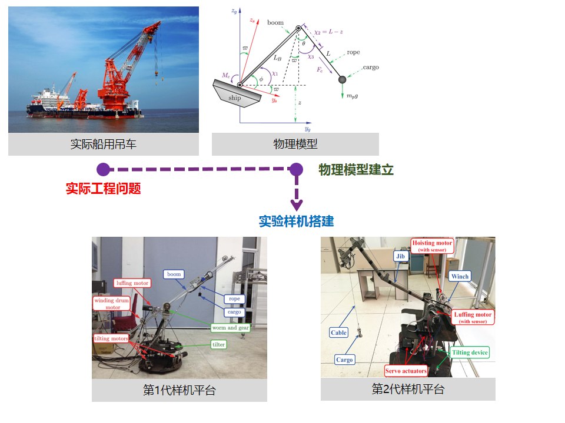

## 1 陆地吊车
陆地吊车，又称陆地起重机，是一种大型的工程搬运设备，被广泛地应用于冶金、物流、建筑、电力、造纸等诸多领域，完成货物/材料运送与集成加工等任务，在国民经济建设中占据着举足轻重的地位。

迄今为止，吊车的使用已有数千年的历史。据考古记载，最早的吊车诞生于公元前6世纪晚期，由希腊人所发明并用于建造希腊神庙。随着科技的高速发展，吊车正在向着**大型化、智能化、快速化、准确化**等方向发展，其工作性能与可靠性也在日益提升。

陆地吊车主要包括**桥式吊车、塔式吊车、桅杆式吊车**，其控制问题研究具有理论与实际的双重重要意义。
### 1.1 桥式吊车
在各类吊车中，桥式吊车最具代表性，应用也最为广泛。对于吊车系统而言，其所面临的最大问题在于台车运动及外界干扰(如风力等)引发的负载摆动，这不仅会降低整体的效率，影响负载在落吊过程中的精确放置操作，还可能引发碰撞而造成安全事故。在一些特殊的场合，如钢水包搬运，甚至期望能实现“无摆”运送，以防止高温钢水溢溅。
#### 1.1.1 研究挑战
- **欠驱动特性**，即控制输入个数少于系统自由度个数。仅能操纵台车的水平运动和负载的升/落吊运动，而无法直接对负载的空间摆动施加控制。如何实现**以“少”控“多”**，是控制方法设计的最根本的需求。
- **非线性、强耦合**。吊车系统的各状态之间相互耦合，台车的水平运动及吊绳的伸缩会不可避免地引发负载的空间摆动。
- **状态与控制约束**。受制于物理约束，台车运行速度/加速度、摆角幅值、控制输入等必须保持在特定范围内。如何在状态与控制受限的情况下实现高性能控制，极具挑战。

#### 1.1.2 研究成果
- 提出了多种轨迹规划算法及非线性控制方法，大幅提高了桥式吊车系统的控制性能与工作效率
- 搭建了**3代实验样机平台**，联合天津起重设备有限公司搭建了一台32吨级自动工业吊车
- 在**Automatica、IEEE Transactions上发表高水平学术论文10余篇。获2016年中国自动化学会优秀博士论文奖、2017年吴文俊人工智能自然科学一等奖、2017年天津市专利奖-金奖、2018年中国高校科技成果交易会“优秀项目展示奖”、2013年关肇直奖提名奖等奖励**
- **受理中国发明专利6件**
- **注重理论与实践相结合**，在吊车控制应用方面，相比当前主流的闭环反馈控制方法，提出的基于相平面几何分析的轨迹规划控制技术(经国家起重运输机械质量监督检验中心检测)可使运送效率提高77%以上，在行程6米时，最大**定位误差不超过5毫米，摆角不超过1度**

**插入视频的方法一（youtube）：**


**插入视频的方法二（bilibili）：**


**插入视频的方法三（本地视频）：**


### 1.2 塔式吊车
相比于桥式吊车，塔式吊车包含旋臂的旋转运动，且其工作环境更为恶劣(高空、强干扰等)。旋转运动更容易激发负载在空间内的摆动，因此塔吊具有**更加复杂的欠驱动特性、更强的非线性，且系统状态之间具有更强的耦合性**。在这种情况下，非常难以实现负载的快速精准定位与消摆。然而，塔身高、回转半径大等特点，又使得塔式吊车的工作空间广、垂直作业效率高，更加适用于高层建筑的建设与修缮，这使其成为建筑业不可或缺的关键设备之一。因此，如何实现塔式吊车的高性能制动控制，具有非常重要的实际应用价值与意义。

#### 1.2.1 研究挑战
相比于桥式吊车，塔式吊车包含旋臂的**旋转运动**，且其工作环境**更为恶劣**(高空、强干扰等)。旋转运动更容易激发负载在空间内的摆动，因此塔吊具有更加<mark style="background-color: #ace5fa;">**复杂的欠驱动特性、更强的非线性，且系统状态之间具有更强的耦合性**</mark>。在这种情况下，非常难以实现负载的快速精准定位与消摆。

#### 1.2.2 研究成果
- 从工程角度出发，通过问题提炼，建立了塔式吊车系统的非线性完整动力学模型，并搭建了**实验样机平台**

- 考虑多种实际因素，在运动规划、非线性控制方面提出了若干种方法，可以同时实现快速定位与消摆等控制目标，提升了系统的控制性能。在**IEEE Transactions、MSSP等期刊上发表高水平学术论文6篇(其中一区4篇，二区2篇)**



### 1.3 桅杆式吊车
相比桥式吊车，桅杆式吊车体积相对较小，既可以加载于车辆上，又可以固定于地面，具有较强的灵活性和更少的能耗，应用场景更加广泛。吊杆可以完成俯仰及旋转两个方向上的转动，在保证有限占地面积的同时极大地扩展了作业空间，提高了工作效率。

然而，桅杆式吊车状态量之间存在着非常强的耦合特性，同时涉及俯仰和旋转运动，会产生复杂的离心力，导致其动力学方程十分复杂，呈现出高度的非线性和耦合性，进一步增加了控制的难度。
#### 1.3.1 研究挑战
相比桥式吊车，桅杆式吊车状态量之间存在着更强的耦合特性，同时涉及俯仰和旋转运动，会产生复杂的离心力，导致其动力学方程十分复杂，呈现出高度的非线性和耦合性，进一步增加了控制的难度。

#### 1.3.2 研究成果
- 从工程角度出发，通过问题提炼，建立了桅杆式吊车系统的非线性完整动力学模型，并搭建了实验样机平台
- 在运动规划、非线性控制方面提出了若干种方法，大幅提高了系统的工作效率，在此基础上，在IEEE Transactions等期刊上发表高水平学术论文4篇，其中1篇入选ESI热点+高被引论文
- 受理中国发明专利1件

### 1.4 两级摆吊车
就目前而言，几乎所有研究人员在分析桥式吊车系统时，都忽略吊钩的质量，或把吊钩与负载视为同一质点，即将系统的动力学简化为单级摆动吊车。而事实上，在很多情况下，当台车运行时，吊钩会绕台车产生第一级摆动，货物则将相对于吊钩产生第二级摆动，即整个吊车系统会呈现出显著的两级摆动。

两级摆动特性的出现导致整个系统的自由度个数增加，在控制量维数不变的情况下，增加了吊车系统的欠驱动程度，增强了系统状态之间的耦合度，因而进一步加剧了非线性特性。如果不能充分考虑两级摆动特性的影响，在系统呈现出两级摆动时将无法取得良好的控制效果，严重时甚至导致闭环系统不稳定。

因此，深入探讨两级摆动的动态特性对吊车系统的影响，并以此为基础，开发高性能运动规划及消摆定位控制方法以提高系统的工作效率与安全性能，具有非常重要的研究价值。

#### 1.4.1 研究挑战
两级摆动特性的出现导致整个系统的自由度个数增加，在控制量维数不变的情况下，增加了吊车系统的欠驱动程度，增强了系统状态之间的耦合度，因而进一步加剧了非线性特性。如果不能充分考虑两级摆动特性的影响，在系统呈现出两级摆动时将无法取得良好的控制效果，严重时甚至导致闭环系统不稳定。因此，深入探讨两级摆动的动态特性对吊车系统的影响，并以此为基础，开发高性能运动规划及消摆定位控制方法以提高系统的工作效率与安全性能，具有非常重要的研究价值。

#### 1.4.2 研究成果
- 从工程角度出发，通过问题提炼，建立了双摆桥式吊车系统的非线性完整动力学模型，并搭建了实验样机平台
- 针对双摆效应，提出了若干种方法，大幅提高了系统的工作效率，在此基础上，在IEEE Transactions等期刊上发表高水平学术论文5篇，其中1篇入选爱思唯尔献礼南开大学百年校庆推出的《南开大学优秀论文合辑》(全球被引次数前1%的高被引论文)，本领域唯一一篇；也同时入选对“卓越工程”有突出贡献的科学论文，2篇同时入选ESI热点+高被引论文，1篇入选ESI高被引论文
- 相关成果获2016年第31届中国自动化学会青年学术年会最佳论文(应用)奖
- 受理中国发明专利2件

#### 1.4.3 实验视频


 

 


## 2 船用吊车
海上吊车一般指负载吊运过程位于海面之上，主要用于舰船间货物的运输转移等。与陆地吊车等类似，海上吊车在运输过程中，需要解决由于意外碰撞等引起的负载摆动的抑制问题。此外，由于吊车安装于船体之上，而船体本身受到海浪、海流的影响会产生多个自由度的平动与转动，进而严重影响负载的运输与定位，因此，在控制过程中必须对船身的运动进行有效补偿。船体运动导致的负载扰动通常远大于意外碰撞的影响，且导致整个系统工作在非惯性系，给控制方法设计及分析带来了巨大挑战。

### 2.1 海上吊车

#### 2.1.1 研究挑战
欠驱动、非线性、耦合性：类似陆上各种欠驱动吊车设备，需要控制负载运输过程中产生的摆动，保证其定位精度与运输效率。

强干扰、不确定性：由于吊车固定于船舶等运动平台上，平台本身的运动会对负载运动产生强烈的影响，且很多情况下，负载起吊与降落点处的运动情况与吊车本身的运动不一致。具体而言，在工作过程中，吊车船与接收船会随海浪纵摇、横摇与升沉，这些运动将导致负载发生摆动；特别是在升降过程中，船舶的此类运动易导致已吊起的负载再次与甲板相撞，或使已放下但尚未脱离吊钩的负载再次悬空，这些都会威胁作业的安全。尤其在进行舰船间弹药补给时，这种耦合运动可能造成非常严重的后果。

#### 2.1.2 研究成果
- 建立了船用起重机系统的非线性完整动力学模型，并搭建了2套实验样机平台
- 提出了若干种行之有效的控制策略，可有效抑制船体运动干扰，且在参数不确定等情况下，能实现负载的精准、快速定位。在IEEE Transactions、Automatic等期刊上发表高水平学术论文7篇(其中一区6篇，Q1区1篇，1篇同时入选ESI热点+高被引论文，1篇入选ESI高被引论文
- 受理中国发明专利4件

#### 2.1.3 实验视频


### 2.2 深海吊车
近年来，在我国“海洋强国”战略、“陆海统筹”规划等指引下，深海资源的开采与利用备受瞩目，而深海吊车是作业过程中不可或缺的吊运设备。与海上吊车类似，深海吊车也安装于受海浪、洋流等影响的船体上，但其吊运负载一般位于海面以下、具体深度不等。这样一来，负载振动不仅受船体运动的影响，还因处于水中而使振动幅度被放大、更为敏感，同时也增加了负载的柔性特性。因此，深海吊车的动力学模型更为复杂，负载的振动也更加难以抑制。

#### 2.2.1 研究挑战
- **欠驱动、非线性、耦合性**：系统不仅处于非惯性系，台车的大范围空间运动、水作用力影响等都会使动力学更复杂，状态量间耦合性更强。

- **分布质量系统**：特殊的吊运环境（水中）赋予了负载或缆索一定的柔性特性，从而引入偏微分项，增大分析难度。

- **强干扰、不确定性**：吊车本体的干扰运动、海面对船体的扰动、海面以下对负载的扰动等导致系统存在未建模动态以及各种不确定干扰，进一步增加了控制难度。

#### 2.2.2 研究成果
- 分析深海吊车复杂的动力学模型，搭建了**实验样机平台**
- 在轨迹规划、智能控制等方面提出了若干种方法，有效抑制了负载振动。相关成果发表于**SCI、自动化学报等期刊上**

## 3 其他欠驱动
### 3.1 欠驱动RTAC/TORA系统
欠驱动RTAC/TORA系统是一种典型的欠驱动系统，由可驱动的旋转转子与不可驱动的、做平移运动的定位平台组成，可用于研究振动筛等大型机械设备的工作原理，同时也可用于分析振动系统自同步现象。该系统的各状态相互耦合，表现出很强的非线性特性，给其控制方法设计与稳定性分析带来了很大的挑战。

#### 3.1.1 研究成果
- 搭建了**2套实验样机平台**，提出了多种行之有效的非线性控制方法
- 在**IEEE Transactions**上发表高水平学术论文**3篇(均为一区，中科院top)**，**其中2篇入选ESI高被引论文**
- 获第十五届“挑战杯”全国大学生课外学术科技作品竞赛一等奖
- 部分实验结果见下面视频

#### 3.1.2 实验视频


### 3.2 平衡机器人系统
由于具有灵活度高、结构简单、体积小等优点，平衡机器人在很多领域发挥着重要作用，如货物搬运、家庭服务等，同时它也被应用于教育、科研等领域，其控制研究已成为当前机器人领域的重要方向之一。

平衡机器人是一种典型的欠驱动、强非线性、本征不稳定系统，其自动控制算法的设计与分析具有诸多挑战。尤其是当它们在很多情况下运行在非平坦的路面上，导致系统的动力学特性更加复杂。因此，针对平衡机器人的自动控制研究，具有理论与实际的双重意义。

#### 3.2.1 研究成果
- 建立了自平衡机器人系统的在斜面、起伏路面上的非线性动力学模型。实验室拥有 Googol Gbot2001平衡机器人一台
- 提出了多种轨迹规划、非线性控制方法，可实现平衡机器人的快速定位、跟踪及平衡控制。在IEEE Transactions等期刊上发表高水平学术论文2篇(其中一区，中科院top，人工智能领域的顶级学术期刊1篇)
- 部分实验结果见下面视频

#### 3.2.2 实验视频


