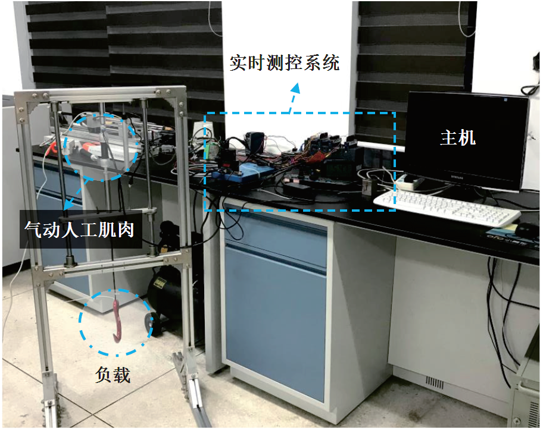
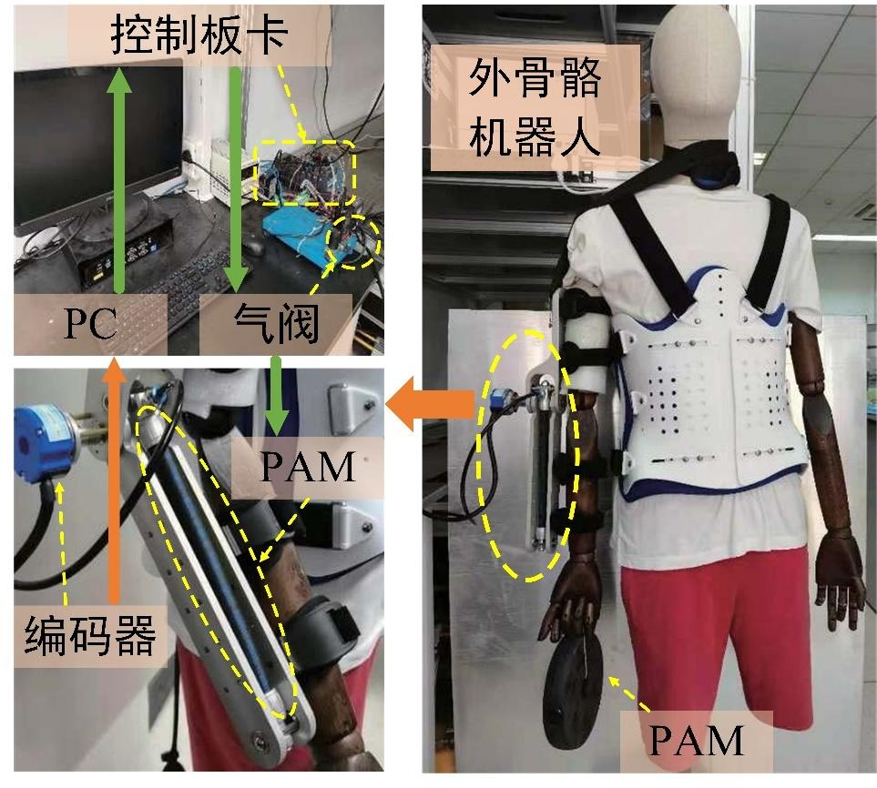
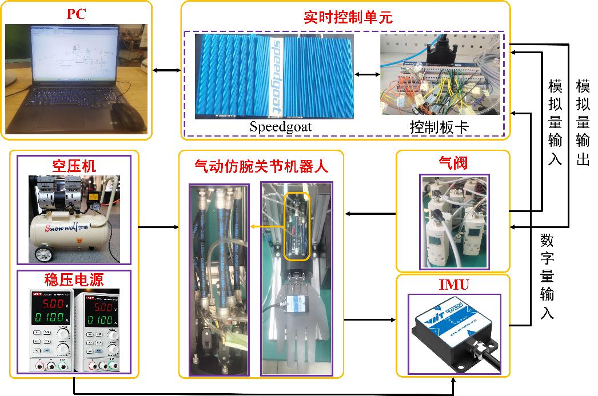

第四次智能浪潮的脚步接踵而至，工业制造、医疗康复、抢险救灾等领域智能化、自主化需求日益迫切，仅使用传统刚性驱动方式(如电机、液压等)去协助人类完成简单重复的机械任务，很难进一步推动新一轮科技革命和产业变革。与生物肌肉具有基本相似形态结构、如出一辙运动机理的柔性元件——**气动人工肌肉(pneumatic artificial muscle，简称PAM)**，逐渐成为了机器人驱动、建模、控制领域的重点关注对象。PAM结构简单、材料轻便，当其作为智能机器人的主要驱动元件时，可颠覆性地突破传统驱动元件柔性不足、机构繁琐等局限性，进一步地提高人机交互的安全性和舒适性。
## 2.1 单PAM机器人
气动肌肉的材料和结构特殊，导致其存在高非线性、时变特性、迟滞性等，当机器人结构模型较为复杂时，整体动力学模型建立与精确运动控制难度激增。由于单气动肌肉机器人自由度较低，整体机械结构也相对简单，因此单气动肌肉机器人成为了探索该领域的一个首选切入点。目前其主流建模方案主要分为静态特性建模和动态特性建模。其中，静态模型主要研究肌肉长度、收缩力和气压三者之间的关系，动态模型主要是通过分析肌肉伸缩过程中内部的气流作用，来描述其动态特性。
### 2.1.1 研究挑战
- 单气动肌肉机器人存在高度非线性、不确定性、以及单向输入约束等问题
- 绝大多数文献没有考虑跟踪误差的边界约束问题，难以确保安全性
- 实际工作环境中不可避免地受到外界持续扰动，可能破坏系统稳定性
- 气动肌肉控制领域现存大多数自抗扰控制方法忽略扰动变化率的影响
### 2.1.2 研究成果
- 提出连续自适应鲁棒控制方法
- 提出基于神经网络估计的自适应控制方法
- 提出基于高阶扰动观测器的非线性控制方法

### 2.1.3 实验视频






## 2.2 双PAM机器人

基于特殊的结构特性，单根气动肌肉仅能提供在**单一直线方向上的收缩/伸展运动**。由于实际机器人通常需要实现复杂多变的控制目标，单根气动肌肉远不足以实现多个自由度的运动。因此，人们往往使用多根气动肌肉共同驱动机器人的多个关节来解决上述难题。此外，多气动肌肉机器人的控制方法并不是简单地从单肌肉平台移植而来，肌肉数目的增加、肌肉之间耦合程度的加剧，导致系统模型发生很大的变化，需结合多根气动肌肉的具体组合形式重新考虑控制器设计。在多气动肌肉机器人中，最为典型的为**双气动肌肉机器人**。

### 2.2.1 研究挑战

- 实际执行机构的驱动能力有限
- 单纯使用滑模控制去抑制系统不确定性容易加剧抖振现象
- 实际工况可能面临持续的未知干扰
- 多数相关工作尚未引入减振机制，很难消除残余振荡
- 现有模型大多是关于转矩的方程，而转矩并非系统真实的控制输入
- 现有方法并未限制系统超调和讨论奇异性，可能存在安全隐患

### 2.2.2 研究成果

- 自行搭建设计了一台双气动肌肉机器人
- 建立更加直接有效的精确动力学模型
- 提出基于能量的非线性控制方法
- 提出考虑单向约束、饱和、死区的自适应模糊滑模控制方法

### 2.2.3 实验视频




## 2.3 并联气动肌肉

在人机共融的发展趋势下，气动人工肌肉这种质量轻、结构简单、力自重比大的新型软体驱动器逐渐备受青睐。特别地，气动人工肌肉可以通过充气和放气模仿生物肌肉的收缩和舒张行为，柔顺性更好，有助于调节并联机器人的刚度，使气动人工肌肉并联机器人表现出“刚柔耦合”特性，进而在仿生、医疗康复等需要“软接触”的场景中发挥更出色的价值。

### 2.3.1 研究挑战

- 气动人工肌肉中存在多重输入约束（死区、饱和、单向输入）以及物理结构摩擦、变形等因素造成的复杂非线性输入－输出关系（迟滞、蠕变），这些特性会对气动人工肌肉系统的控制性能产生不利影响。
- 和串联机器人相比，并联机器人不仅具有高度非线性、不确定性和强耦合等特征，其闭环机械结构还会增加建模、运动控制的难度，且整体控制性能会受制于所有机械臂间的协调水平。

### 2.3.2 研究成果

基于实际应用需求和现有研究的不足，开展了气动人工肌肉并联机器人的准确建模和运动控制研究，发表/录用期刊/会议论文7篇。提出了以气压为系统输入的动力学模型、改进的积分/微分迟滞模型；充分考虑气动人工肌肉的多重输入约束以及具有累积效应的未知动力学特性，提出了基于运动约束/LSTM神经网络的预设性能控制方法，实现定量跟踪控制，改善暂态和稳态性能，提升运行安全性；针对并联结构的多运动链问题，提出了笛卡尔空间上的有限时间同步控制方法，提升机械臂的运动同步性，提高运动精度和工作效率；为应对复杂环境下的不利干扰，提出了基于扰动预见的模型预测控制方法，增强系统鲁棒性，提高模型预测准确度，降低计算成本。

### 2.3.3 实验视频



## 2.4 外骨骼

气动肌肉驱动的外骨骼机器人凭借轻量化、柔性驱动和高功率密度等优势，能够显著提高人体的运动能力，在军事、民用及医疗康复等领域具有广泛的应用价值。然而，随着肌肉数目的增加和肌肉之间耦合程度的加剧，外骨骼机器人动力学建模变得极为复杂。由于精确的机理模型难以获取，并且需要综合考虑多根气动肌肉的具体组合形式，如何设计高效且稳定的运动控制方法，以确保轨迹跟踪的精度和系统的鲁棒性，已成为亟待解决的关键问题。

### 2.4.1 研究挑战

- 气动肌肉驱动的外骨骼机器人存在高度非线性、耦合性、迟滞性和不确定性
- 密切的人机交互及外部非参数扰动组成的集总扰动严重降低控制性能
- 现有研究较少考虑跟踪误差的约束边界问题，使得外骨骼机器人难以在安全范围内稳定运行
- 初始控制输入过大或超出允许范围导致系统不稳定

### 2.4.2 研究成果

- 提出基于学习和误差约束的非线性控制方法

### 2.4.3 实验视频



## 2.5 仿生手腕

研究人员通常采用多根气动肌肉协同驱动的方式，以提升运动灵活性，从而满足复杂工况下的多样化作业需求。相比于串联或并联气动肌肉，拮抗式气动肌肉利用两根或多根气动肌肉间相互制约与协作的特点，通过调节主动肌和拮抗肌的气压变化，实现更精确的运动控制。基于此，仿腕关节机器人采用三对拮抗式气动肌肉进行设计，使其具备屈曲/伸展、尺偏/桡偏和旋前/旋后三个自由度的运动能力，从而具备更高的灵活性和适应性。然而，仿腕关节机器人存在着高度非线性和强耦合特性，导致其动力学方程十分复杂，进一步增加了控制方法的设计难度。

### 2.5.1 研究挑战

- 仿腕关节机器人存在强非线性、迟滞性和不确定性，每对拮抗关节之间存在强耦合性
- 每对拮抗关节中主动肌过度收缩导致拮抗肌承受过大张力，从而影响系统稳定性，甚至导致肌肉损伤或断裂
- 实际工况可能面临持续的未知干扰
- 传感器测量误差、气压输入延迟以及硬件故障普遍存在
- 在复杂工况下，实现每对拮抗关节的跟踪误差同步收敛是一个关键挑战
- 现有方法较少能在固定时间内确保跟踪误差收敛，同时保证安全的人机交互

### 2.5.2 研究成果

- 自行搭建设计了一台仿腕关节气动肌肉机器人
- 提出基于迭代学习和非对称状态约束的非线性控制方法
- 提出基于固定时间扰动观测器的鲁棒控制方法
- 提出基于动态避障和梯度加速的自适应同步控制方法
- 提出基于动态轨迹修正、多模态约束和设备故障的自适应模糊控制方法

### 2.5.3 实验视频




