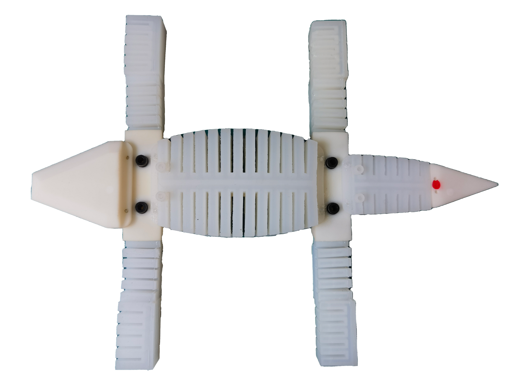
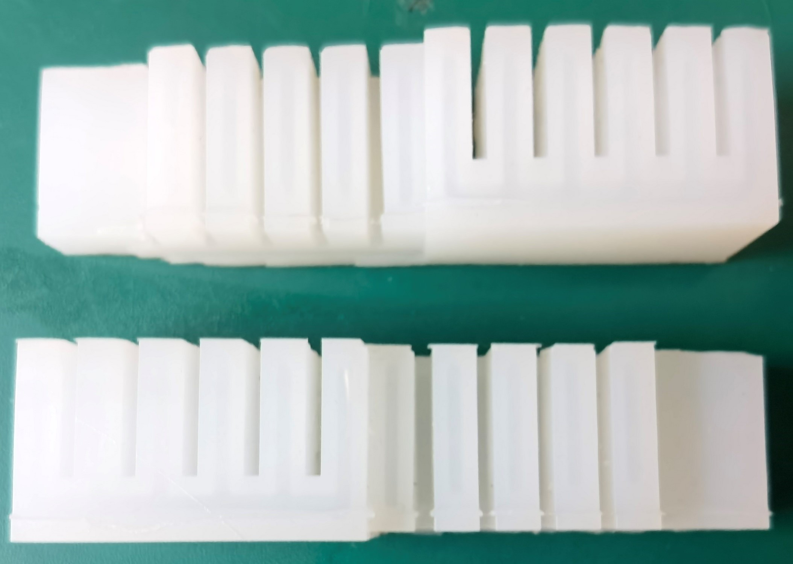

软体机器人作为当前机器人行业研究和发展的前沿热点领域之一，相较于传统的刚体机器人，具备运动自由度高、环境柔顺性强、制作成本低、可适应复杂的外界环境并与人良好交互等显著优势，在抢险救灾、军事侦察、医疗康复等重要领域拥有巨大的应用潜力。然而，现有软体机器人的设计结构负载能力弱，运动速度慢，不具备在不同平面上稳定运动的能力。此外，考虑软体驱动器的强非线性、强耦合性以及制作误差，软体机器人的运动非常容易偏离目标，甚至操作不当还会导致驱动器的损坏。因而，当前软体机器人的运动仍高度依赖于人工操作经验。为此，需要设计新结构的软体驱动器与机器人，提出有效的建模与控制算法，实现软体机器人在不同环境中快速、准确、稳定运动。

## 5.1 气动软体机器人

### 5.1.1 研究挑战

1. 复杂的结构设计与制作：为充分模仿生物特性，提升负载能力与运动速度，软体机器人及其驱动器的结构设计较为困难，不仅需要考虑运动功能的实现，还要尽可能减少气路消耗、避免复杂结构以及还原生物运动模态。此外，弹性较好的柔性材料往往需要通过人工进行浇铸制作，导致模具与制作流程的设计难点以及大量的稳定性测试。
2. 模型难以描述：由于自身的柔性材料和复杂结构，软体机器人及其驱动器往往伴随着强非线性（无限自由度、弹性等）、强耦合性（驱动器内部形变、多驱动器协作等）等特性，使得其模型特性很难被准确描述，严重限制了对软体机器人形变的量化说明以及后续的规划与控制研究。
3. 形变与运动控制困难：受限于由自身弹性及驱动系统产生的迟滞、由柔性材料导致的有限承载能力等因素，使软体机器人的形变与运动控制设计不能简单专注于跟踪精度，必须综合考虑多个方面。此外，软体驱动器初始加载气压时容易产生较大的振荡，可导致后续运动的不准确。

### 5.1.2 研究成果

- 设计了一种新结构的三维形变气动软体驱动器，一种受鳄鱼启发的气动软体爬行机器人以及一种环抱式气动软体抓手，提供了相应的制作方法与性能分析。

- 建立了三维形变气动软体驱动器的分析模型、运动学模型和动力学模型。

- 提出了一种基于迟滞补偿的三维形变气动软体驱动器代理滑模跟踪控制方法。
- 提出了一种基于动力学模型的三维形变气动软体驱动器自适应模糊形变控制方法。

### 5.1.3 实验视频

#### 软体机器人







#### 驱动器



